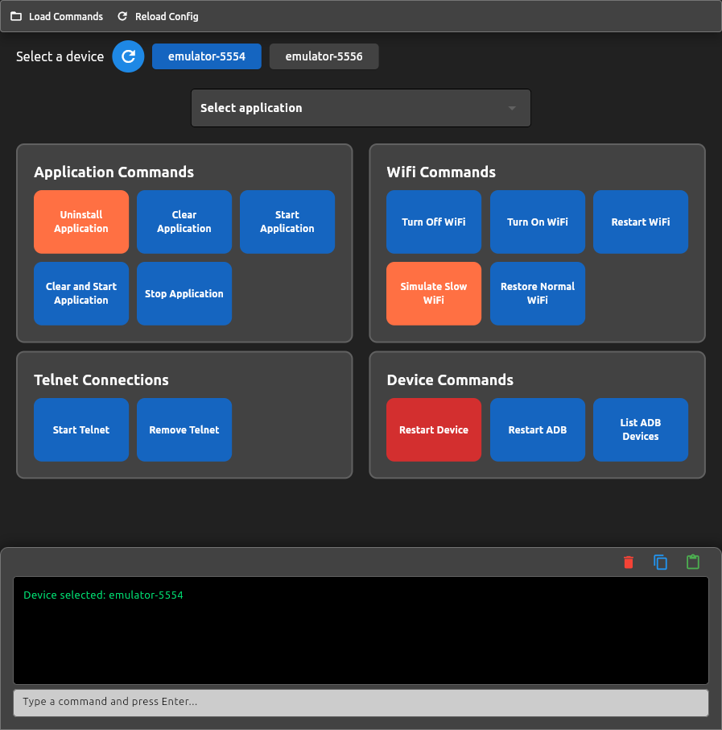

# Command Manager Pro

## Description

Command Manager Pro is a desktop application built with Python and Flet that provides an intuitive graphical interface for executing and managing commands efficiently. It is designed for any user looking for a simpler and more convenient way to run commands without relying on the traditional terminal.



### Features:

- **Modern UI:** Execute commands from a clean and intuitive graphical interface.
- **Customizable Commands:** Load and execute predefined commands from JSON configurations.
- **Variable Support:** Use reusable variables in commands for flexibility.
- **Elevated Permissions Support:** Run commands with `sudo` on Linux/macOS
- **Device Detection & Selection:** Supports ADB for managing Android devices.
- **Integrated Terminal Output:** Displays real-time execution logs within the application.


## Download

You can download the latest version of Command Manager Pro for your operating system:
- **Linux:** [Download](https://github.com/StevenCalderon/command-manager-pro/releases/latest)
- **Windows:** PENDING
- **macOS:** PENDING 

> 🚀 **Tip:** Always download the latest version from the [Releases](https://github.com/StevenCalderon/command-manager-pro/releases) page.

## Installation (From Source)

1. **Clone the repository:**

   ```bash
   git clone https://github.com/StevenCalderon/command-manager-pro.git
   cd command_manager_pro
   ```

2. **Install dependencies:**

   ```bash
   pip install -r requirements.txt
   ```

3. **Run the application:**
   ```bash
   python src/main.py
   ```

## Contributing

We welcome contributions! Feel free to fork the repository, create a feature branch, and submit a pull request. Please ensure your changes are well-documented and include necessary tests.

## License

This project is licensed under the MIT License. See the [LICENSE](LICENSE) file for more details.

# User Instructions

Command Manager Pro is the ultimate tool for managing and executing commands on devices and emulators efficiently and easily. With its intuitive interface and customizable configurations, you can streamline your workflows and boost productivity.

### Configuring config.json
The `config.json` file is the heart of the application and is organized into three key sections:

#### Variables
Define reusable parameters, such as:

- Network settings
- Access credentials

These variables can be used directly within commands for greater flexibility.

#### Applications
Lists the applications you can control. Just define:

- Name of the app
- Package of the app

#### Panels
Groups commands into categories, such as:

- Application Commands
- Device Commands

You can customize this section by adding your own commands!

### Workflow
1. **Select Device**

   - Choose between connected physical devices or emulators.
   - If none appear, click **Reload** to update the list.
   
2. **Select Application**

   - Choose the app you want to control.
   
3. **Execute Commands**

   - Click the buttons to run commands on the selected device and application.

### User Interface
- **Main Menu**
  - **Load Commands** – Loads commands from `config.json` for immediate use.
  - **Reload Config** – Updates configuration from the file.
  
- **Device Selection** – Choose between real devices or emulators.
- **Application Selection** – Select the app you want to control.
- **Command Buttons** – Execute commands with one click, organized for easy access.
- **Terminal** – View real-time output of executed commands and interact with the built-in terminal.

### Add Custom Commands
Customization is key! You can add and personalize your own commands in the **Panels** section of `config.json`.

**Features:**
- Organize commands into categories
- Assign colors to buttons
- Use variables like:
  - `{{device}}`
  - `{{app_package}}`
  - And more!

Make Command Manager Pro truly yours!

### Transform Your Workflow
With customization capabilities, ease of use, and powerful features, Command Manager Pro helps you optimize workflows quickly and efficiently.

Take control of your devices and applications like never before!
